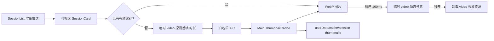

# Design: 会话库可视区懒加载与缩略图缓存

## 1. Architecture



- `SessionList` 每批只挂载固定数量的会话卡片，底部哨兵进入预取区时追加下一批；已经挂载的图片卡片保留，回滚不闪烁。
- `SessionCard` 用 `IntersectionObserver` 控制无缓存会话的首次视频探测。有效缓存卡片常态只渲染 ``；悬停达到既有延迟后才挂载 `<video>`。
- Main 新增独立缩略图缓存模块，负责可信路径、原子写入、源视频指纹校验和生命周期清理；Renderer 不接触缓存绝对路径。

## 2. Data Model & Interfaces

```typescript
interface SessionThumbnailInfo {
  url: string
  durationMs: number | null
}

interface SaveSessionThumbnailRequest {
  sessionId: string
  webp: ArrayBuffer
  durationMs: number | null
}

interface ThumbnailMetadata {
  version: 1
  sessionId: string
  durationMs: number | null
  sourceSize: number
  sourceMtimeMs: number
  updatedAt: string
}
```

- `RecordingSession` 增加可选 `thumbnail`，只携带自定义协议 URL 和缓存时长，不暴露本地绝对路径。
- 新 IPC：保存会话缩略图。Main 校验 sessionId、WebP 大小上限、会话可用性和源视频指纹后，以临时文件 + rename 写入 `.webp` 与 `.json`。
- 缓存根固定为 `app.getPath('userData')/cache/session-thumbnails/`；每会话一份 WebP 和元数据文件。
- `media://thumb/<sessionId>/thumbnail.webp` 只允许读取缓存模块解析出的受信文件。

## 3. Data Flow & Interaction

1. 会话库获取完整轻量元数据，保持准确总数、分类与日期分组。
2. 列表先挂载首批卡片；滚动哨兵进入下方预取区时追加下一批，直到当前分类全部挂载。
3. 已有有效缓存的卡片直接加载 WebP 和缓存时长，不请求 `screen.webm`。
4. 无缓存卡片只有进入可视区附近后才挂载探测视频；metadata 可用后定位代表帧并通过 Canvas 编码 WebP。
5. Renderer 经 IPC 保存缓存并立即切换为本地 Blob/缓存 URL，随后卸载探测视频。
6. 用户悬停卡片超过 160ms 时临时挂载视频并播放；移开后暂停、移除 `src` 并卸载。
7. 源视频大小或 mtime 与元数据不一致时，Main 将缓存视为失效并异步清理；卡片重新走可视区提取。
8. 永久删除、清空回收站或移除失效索引时同步清理对应缓存；移入回收站与恢复期间保留缓存。

## 4. Error Handling

- **提取失败**：卡片回退现有显示器占位图，保留打开和管理能力；进入可视区或刷新时可重试，不阻断其他卡片。
- **缓存损坏/失效**：Main 不返回缓存 URL并清理残留，Renderer 按无缓存会话重新生成。
- **写入失败**：本次卡片可继续使用内存 Blob；不显示原始堆栈，下次进入时重新尝试持久化。
- **存储位置不可用/源缺失**：不生成缩略图，沿用既有状态和操作限制。
- **快速切换分类或卸载页面**：取消 IntersectionObserver、计时器和临时媒体；迟到的生成结果按 sessionId 归属，不写入其他卡片。

