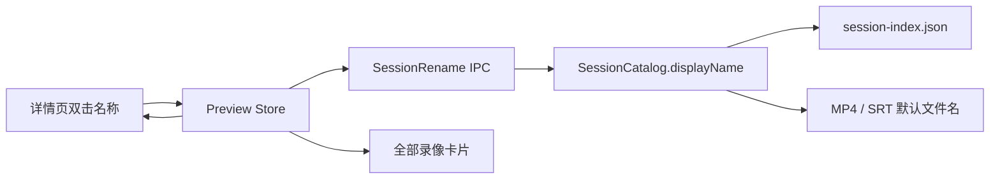

# Design: 录像显示名称与内联重命名 (Design)

## 1. Architecture

`RecordingSession.displayName` 为可选会话元数据，持久化于 Main 的 `session-index.json`；稳定身份、目录和 `media://` URL 继续使用 `sessionId`。



## 2. Data Model & Interfaces

```typescript
interface RecordingSession {
  sessionId: string
  displayName?: string
}

interface RecorderApi {
  renameSession(sessionId: string, displayName: string): Promise<string>
}
```

- `displayName` 长度为 1–80，trim 后不能为空。
- 禁止 Windows/macOS 文件名危险字符、控制字符、尾随句点和 Windows 保留设备名，确保后续导出可直接复用。
- 会话目录、缩略图缓存键、字幕任务键及编辑文档引用均不变。

## 3. Data Flow & Interaction
1. 用户双击详情页名称，原地切换为输入框并全选现值。
2. Enter 或失焦提交；Escape 取消。Renderer 先执行共享校验，再调用 IPC。
3. Main 再次校验并原子持久化索引中的 `displayName`。
4. Preview Store 同时更新 `current.session` 与 `sessions` 中相同 `sessionId` 的项。
5. Main 保存 MP4/WebM 或打开 SRT 保存对话框时读取最新显示名称；缺失时回退 `sessionId`。

## 4. Error Handling
- **空值/非法字符/过长**：输入框保持编辑并显示就地错误，不调用 Main。
- **索引写入失败**：保留原名称，显示用户可读错误并允许重试。
- **历史会话**：不存在 `displayName` 时无迁移操作，读取与导出回退 `sessionId`。
- **同名导出**：继续复用既有 `(1)`、`(2)` 无覆盖命名策略。
