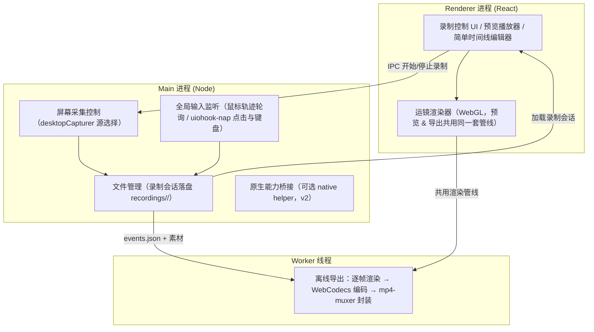

# Design: screen-recorder (Design)

## 1. Architecture

三进程模型（依据 `docs/TECH_DESIGN.md` §2）：



关键设计原则：**录制与渲染分离**。
- 录制期只做两件事：MediaRecorder 高码率编码原始画面、高频记录鼠标/键盘事件。CPU 占用尽量低。
- 渲染期预览与导出共用同一个"虚拟相机 + WebGL 合成器"：预览是实时模式（`<video>` + `requestVideoFrameCallback`），导出是 Worker 线程内的确定性逐帧模式（时间轴驱动，WebCodecs `VideoDecoder` 精确取帧），保证 60fps 恒定输出。

目录划分（`docs/TECH_DESIGN.md` §6）：`electron/`（Main：capture/input/store）、`src/`（Renderer：components/timeline/render/export）。

## 2. Data Model & Interfaces

录制会话落盘格式（`recordings/<session-id>/`）：`screen.webm` + `mic.wav`（可选）+ `webcam.webm`（可选）+ `events.json`。

`events.json` 的 TypeScript 类型定义（所有时间戳相对录制开始，单位 ms，与视频帧对齐）：

```typescript
/** events.json 顶层结构，version 用于后续格式演进 */
interface RecordingEvents {
  version: 1;
  /** 录制开始的 Unix 时间戳（ms） */
  startTime: number;
  /** 录制时的显示器信息，用于多屏/缩放坐标换算 */
  display: {
    id: number;
    /** [x, y, width, height]，屏幕坐标系 */
    bounds: [number, number, number, number];
    scaleFactor: number;
  };
  video: {
    width: number;
    height: number;
    fps: number;
    /** 相对会话目录的文件名，如 "screen.webm" */
    file: string;
  };
  /** 鼠标轨迹，压缩为 [t, x, y] 三元组数组（量大，可上万条/分钟），60–120Hz 采样 */
  mouseTrack: Array<[number, number, number]>;
  clicks: ClickEvent[];
  keys: KeyEvent[];
}

interface ClickEvent {
  t: number;
  x: number;
  y: number;
  /** 1=左键 2=中键 3=右键 */
  button: 1 | 2 | 3;
}

interface KeyEvent {
  t: number;
  /** 归一化后的按键名，如 "Enter"、"A"、"Shift" */
  key: string;
}
```

渲染侧核心模型：

```typescript
/** 虚拟相机状态：视口中心点 + 缩放倍率 */
interface CameraState {
  x: number;
  y: number;
  zoom: number;
}

/** 相机关键帧（由点击事件自动生成，M5 起支持手动编辑） */
interface CameraKeyframe {
  t: number;
  target: CameraState;
  /** spring 插值参数（阻尼/刚度），默认取全局运镜参数 */
  spring?: { stiffness: number; damping: number };
}

/** 采集器抽象：为原生 helper（方案 B）预留的光标开关 */
interface CaptureOptions {
  sourceId: string;
  /** MVP 阶段恒为 true（光标烧录进画面）；原生 helper 落地后可为 false */
  captureCursor: boolean;
  audio: { mic: boolean; system: boolean };
}
```

## 3. Data Flow & Interaction

1. **录制**：用户在 Renderer 选择屏幕源 → IPC 通知 Main → `desktopCapturer.getSources` + `getDisplayMedia` 建立流 → `MediaRecorder`（vp9/webm，12–20 Mbps）开始编码 → Main 同时启动 `screen.getCursorScreenPoint()` 60–120Hz 轮询与 uiohook-nap 全局钩子，事件统一打相对时间戳。
2. **落盘**：停止录制后，Main 将 `screen.webm`、`mic.wav`（可选）与 `events.json` 写入 `recordings/<session-id>/`，并记录 `display.id`/`bounds`/`scaleFactor`。
3. **预览渲染**：Renderer 加载会话 → `timeline` 模块遍历 `clicks` 自动生成相机关键帧（点击前 ~200ms 缩放到点击区域，无操作超 N 秒回归 1.0x 全景）→ 虚拟相机按 spring 阻尼插值逐帧求值 → WebGL 合成器按"背景渐变 → 视频画面（圆角+阴影）→ 光标 → 点击波纹 → 按键回显 → webcam 画中画"顺序合成。
4. **导出**：Worker 线程加载同一渲染管线 → 时间轴驱动器以 `t = 0, 1/60, 2/60...` 步进 → 每帧渲染到 `OffscreenCanvas` → `VideoEncoder`（H.264）逐帧编码 → `mp4-muxer` 封装 → Blob 写盘；音频由 `mic.wav` 混入（AudioEncoder 或 ffmpeg.wasm）。

## 4. Error Handling

- **权限拒绝（macOS 屏幕录制 / 辅助功能权限）**：启动与首次录制前探测权限；被拒时引导页给出系统设置跳转指引，禁止进入录制流程，不抛出原始错误堆栈。
- **磁盘空间不足**：开始录制前检查可用空间（按码率预估分钟级占用）；录制中写盘失败时立即停止采集、保留已落盘的会话片段并提示用户，不静默丢数据。
- **采集失败（getDisplayMedia 被拒 / MediaRecorder 异常 / uiohook-nap 钩子启动失败）**：屏幕流失败则终止录制并提示重新选源；输入钩子失败时降级为仅录制画面 + 鼠标轮询轨迹，明确提示"点击/键盘事件未采集，自动运镜不可用"。
- **WebCodecs 不支持 H.264**：导出前探测 `VideoEncoder.isConfigSupported({ codec: 'avc1.*' })`；不可用时按 TECH_DESIGN §5 fallback 到 VP9+webm 封装，或提示引入 ffmpeg.wasm 转码，绝不导出损坏文件。
- **高分辨率风险**：5K 屏幕录制时检测 WebGL 纹理尺寸上限与显存，超限时对输入纹理做降采样并在 UI 明示输出分辨率变化。

