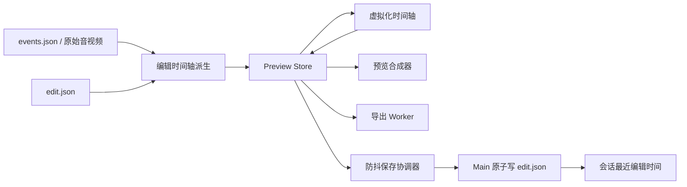

# Design: 可编辑运镜、事件与自动保存 (Design)

## 1. Architecture

本变更在不修改原始 `events.json` 的前提下，引入会话级 `edit.json`。Renderer 负责纯时间轴派生与编辑交互，Main 负责原子落盘和自定义音频资产保存；预览与导出继续消费同一份派生结果。



模块边界：

- `src/timeline/`：运镜片段约束、鼠标时间采样、波纹关联、按键过滤/组合、事件聚合均为纯函数。
- `src/components/preview/`：右键菜单、运镜块手势、按键录入、保存状态、画布位置拖动和事件虚拟化。
- `src/store/`：编辑文档、dirty revision、保存状态和派生引用。
- `electron/store/` 与 `shared/ipc.ts`：读取/原子保存 `edit.json`、复制自定义音频资产、返回 `updatedAt`。
- `src/render/` 与 `src/export/`：按键提示位图/纹理和编辑后的相机、波纹、音频数据共用。

## 2. Data Model & Interfaces

```typescript
interface EditDocumentV1 {
  version: 1
  updatedAt: string
  motionParams: MotionParams
  motionEffects: MotionEffect[]
  manualKeyPrompts: KeyPrompt[]
  hiddenRecordedKeyIndices: number[]
  cuts: CutRange[]
  audioGain: { mic: number; system: number }
  customAudio: PersistedAudioClip[]
  keyboardOverlay: { x: number; y: number }
}

interface MotionEffect {
  id: string
  origin: 'recorded-click' | 'manual'
  startMs: number
  endMs: number
  zoom: number
  sourceClickIndices: number[]
  rippleOffsetsMs: number[]
}

interface KeyPrompt {
  id: string
  t: number
  keys: string[]
  source: 'recorded' | 'manual'
}

interface PersistedAudioClip {
  id: string
  name: string
  assetFile: string
  offsetMs: number
  sourceDurationMs: number
  trimStartMs: number
  trimEndMs: number
  gain: number
}

type SaveState =
  | { kind: 'idle' }
  | { kind: 'saving'; revision: number }
  | { kind: 'saved'; revision: number }
  | { kind: 'error'; revision: number; message: string }
```

- 原始点击没有 ID，加载时以不可变原数组索引形成稳定 `sourceClickIndices`；编辑文档不回写 `events.json`。
- 自动运镜保存其关联点击索引和相对波纹时间；整体移动和左边缘调整会平移关联波纹，右边缘仅改变结束时间。
- 运镜焦点和波纹坐标按编辑后的触发时间从 `mouseTrack` 取最近有效点；轨迹为空时降级到画布中心。
- `keyboardOverlay` 使用输出画布归一化坐标，并由布局函数钳制在安全区。
- 自定义音频导入后复制到会话资产目录，`edit.json` 只保存相对文件名和非破坏式编辑参数。
- `updatedAt` 只在 Main 成功原子替换 `edit.json` 后更新。

## 3. Data Flow & Interaction

1. 打开会话时并行读取 `events.json` 与可选 `edit.json`；无编辑文档时从原始点击生成初始 `motionEffects`。
2. 左键时间轴只 seek；右键将指针换算为源时间，打开钳制在窗口内的上下文菜单。
3. “添加运镜”使用当前全局倍率/停留时长创建手动片段；通过纯函数执行 300ms 最短时长、100ms 网格、磁性吸附、时间轴边界和不可重叠约束。
4. 自动效果组移动时，运镜和关联波纹按相同 delta 平移；左边缘调整同步波纹锚点，右边缘只修改结束时间。派生阶段按新时间采样鼠标坐标。
5. “添加事件”打开按键录入浮层，只接受快捷键、功能键或修饰键；确认后在右键时间创建 `manualKeyPrompts`。
6. 录制采集器维护按下的修饰键集合，普通字符无修饰时丢弃；快捷键生成规范化组合，功能键单独保留，长按重复限流。旧事件通过兼容派生器过滤和组合。
7. 按键提示显示 1.5 秒，新提示替换旧提示并淡入淡出；画布拖动只修改全局归一化位置。
8. “添加音频”选择文件后把资产复制进当前会话，并以右键时间作为 `offsetMs`；超出片尾的部分按既有逻辑非破坏裁剪。
9. 每个编辑 mutation 增加 revision。拖动/滑杆在手势结束时提交，离散输入 500ms 防抖；保存中若又有新 revision，当前写入完成后继续保存最新快照。
10. Main 将 JSON 写入同目录临时文件，flush/关闭后原子替换 `edit.json`，返回新的 `updatedAt`。会话列表按该时间优先排序。
11. 预览与导出分别拿同一份 `motionEffects`、派生波纹、按键提示、裁剪和音频参数，不在导出端重复解释编辑语义。

事件轨性能策略：

- 原始事件过滤、快捷键组合和稳定 ID 仅在事件引用变化时重建。
- 根据 `pxPerSec` 的量化档位决定名称、单点或聚合点；微小滚轮变化不重算档位。
- 当前渲染窗口为可视区加左右各一个视口缓冲；只有滚动接近缓冲边缘时更新窗口。
- 播放头继续命令式更新 DOM，不触发事件轨逐帧 React 渲染。
- Tooltip 仅在 Hover 时创建；聚合点列出事件名称和源时间。

## 4. Error Handling

- **编辑文档缺失**：按原始会话生成默认编辑状态，历史会话正常打开。
- **编辑文档损坏/版本不兼容**：保留原始会话，提示编辑数据无法恢复，并允许回退默认派生；不得破坏原文件。
- **保存并发**：revision 守卫阻止旧响应覆盖新状态；保存期间的新修改排队为下一次最新快照。
- **保存失败**：内存状态和 dirty revision 保留，持续显示“保存失败 · 点击重试”，再次编辑或点击提示可重试。
- **自定义音频复制失败/丢失**：不写入无效 clip；已保存资产丢失时禁用该轨并显示可删除错误，其他编辑正常加载。
- **运镜冲突**：约束函数钳制到合法边界；无可用 300ms 空间时拒绝创建并给出可读提示。
- **鼠标轨迹缺失**：手动或移动后的运镜聚焦画布中心，不生成非法坐标。
- **普通文字历史事件**：仅在派生层隐藏，不重写历史 `events.json`。
- **菜单靠近窗口边缘**：测量后翻转或钳制位置，Escape、点击外部和失焦均关闭。
