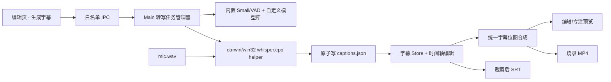

# Design: 录制后离线字幕生成与编辑

## 1. Architecture



- Renderer 只发起任务、展示状态和编辑字幕，不直接加载模型或执行推理。
- Main 以 `sessionId` 为键维护单实例任务；关闭字幕、显式取消、删除会话或退出应用会终止任务。
- `electron/transcription/index.ts` 只做平台分发；`darwin.ts`、`win32.ts` 管理各自 helper 路径和进程生命周期。
- helper 只读取 Main 校验后的会话 WAV 路径，以标准 CLI 进度和临时 SRT 返回结果；最终文档由 Main 校验并原子落盘。
- 预览与导出共用 CaptionBitmapRenderer，字幕层位于视频/运镜/点击效果之上。

## 2. Data Model & Interfaces

```typescript
interface CaptionPosition {
  x: number // 输出画布归一化坐标 0..1
  y: number
}

interface CaptionStyle {
  fontPreset: string
  fontSize: number
  textColor: [number, number, number, number]
  strokeColor: [number, number, number, number]
  strokeWidth: number
  backgroundColor: [number, number, number, number]
  cornerRadius: number
  align: 'left' | 'center' | 'right'
  maxWidthRatio: number
  position: CaptionPosition
  fadeMs: number
}

interface CaptionSegment {
  id: string
  startMs: number
  endMs: number
  text: string
  positionOverride?: CaptionPosition
}

interface CaptionsDocument {
  version: 1
  source: 'mic'
  enabled: boolean
  language: 'auto' | 'zh' | 'en'
  detectedLanguage?: string
  transcriptionModel?: {
    id: string
    name: string
  }
  style: CaptionStyle
  segments: CaptionSegment[]
}

interface CaptionModelInfo {
  id: string
  name: string
  source: 'builtin' | 'custom'
  size: number
  available: boolean
}

type TranscriptionJobState =
  | { state: 'idle' }
  | { state: 'downloading'; progress: number }
  | { state: 'transcribing'; progress: number }
  | { state: 'done'; updatedAt: number }
  | { state: 'cancelled' }
  | { state: 'error'; code: string; message: string }
```

- `captions.json` 与 `events.json` 同处会话目录，所有时间均为源视频时间轴毫秒值。
- `SessionLoadResult` 增加可选字幕 JSON；历史会话无文件时返回 `null`。
- 跨进程契约统一放 `shared/`：模型清单、导入/删除、任务状态、生成/取消/重试、字幕保存和 SRT 保存；生成请求只传稳定 `modelId`，不接受 Renderer 提供的任意文件路径。
- 字体保存为跨平台 preset ID，映射到 macOS/Windows 的系统中文字体栈；预览与导出在同一机器复用完全相同的映射。
- 内置 Small 与 VAD 由 electron-builder 分别放到 Windows/macOS 的 `resourcesPath/whisper-models/`；自定义模型和原子保存的注册表位于 `userData/models/whisper/`。注册表只保存 Main 生成的稳定 ID、显示名称、文件名、大小与摘要。
- `captions.json` 以可选 `transcriptionModel` 向后兼容旧 V1 文档；旧文档缺失时按内置 Small 回显，不改写字幕段。

## 3. Data Flow & Interaction

1. 新录像字幕默认关闭；用户开启后，若不存在字幕则按当前语言和内置 Small 自动开始生成。
2. 打包环境直接解析只读的内置 Small/VAD 资源路径；自定义模型由 Main 从注册表解析。关闭开关会通过 AbortSignal 取消转写链路。
3. 导入时 Main 将用户所选文件复制到同目录临时文件，校验格式和摘要，并用对应平台 helper 做短探针加载；全部成功后原子落盘模型与注册表。
4. 删除只允许作用于自定义模型；先更新注册表再删除精确文件，失败时保持可恢复错误，不触碰 `captions.json`。
5. Main 启动对应平台 helper，以 VAD 限定语音区间并请求词级时间戳；共享纯函数再按停顿、标点、长度和时长重组为句。
6. helper 完成后 Main 校验段落顺序、实际发声区间、时间范围和空文本，把模型 ID/名称连同结果原子写入 `captions.json`。
7. 中文默认使用 Small 高精度模型和简体中文 initial prompt；显式中文或自动检测为中文时，通过 OpenCC 在 Main 侧统一转换为简体后再落盘。
8. 编辑器收到完成事件后载入字幕轨；用户可修改文字、时间、分割、合并、删除、样式和位置。
9. 预览按源时间查询活动字幕；视频裁剪只影响播放映射，不修改源字幕文档。
10. MP4 导出使用相同位图渲染；SRT 把字幕投影到裁剪后时间轴，跨裁剪区的字幕按保留段分割。
11. 用户重新生成前须确认覆盖；生成成功才替换旧文件，取消或失败继续保留旧字幕。
12. 任意编辑先进入 pending，400ms 防抖后进入 saving；落盘成功进入 saved，失败进入 error 并可重试。
13. SRT 导入按原始录像时间轴解析，确认后替换；关闭字幕时不暴露导入入口。

## 4. Error Handling

- **无麦克风轨**：禁用生成按钮并说明仅支持麦克风字幕，其他编辑功能保持可用。
- **内置模型校验失败**：拒绝启动 helper 并提示安装资源损坏，不回退到网络下载。
- **内置资源缺失**：显示安装包损坏错误，不尝试网络下载；预览、编辑和导出已有字幕不受影响。
- **自定义模型导入失败**：清理临时副本且不写注册表；原模型和所有录像数据不受影响。
- **已用模型缺失**：保留字幕与模型名称回显，禁止直接重新生成，直到用户重新导入或选择可用模型。
- **helper 崩溃或输出非法**：终止任务并展示用户可读错误；不创建或覆盖 `captions.json`。
- **页面或会话切换**：任务留在 Main；新页面按 `sessionId` 查询当前状态，不出现跨会话结果。
- **取消/删除会话/退出应用**：终止 helper、清理临时结果；已存在的正式字幕文件不受影响。
- **字幕文件损坏**：忽略字幕层并提供重新生成，不阻断视频和编辑文档加载。
- **字体或绘制失败**：回退内置默认中文字体和安全样式，不阻断导出。
