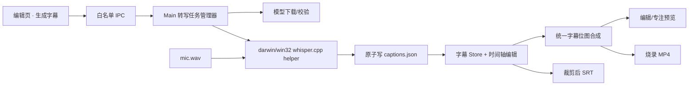

# Design: 录制后离线字幕生成与编辑

## 1. Architecture



- Renderer 只发起任务、展示状态和编辑字幕，不直接加载模型或执行推理。
- Main 以 `sessionId` 为键维护单实例后台任务；离开详情页不取消任务，显式取消、删除会话或退出应用才终止。
- `electron/transcription/index.ts` 只做平台分发；`darwin.ts`、`win32.ts` 管理各自 helper 路径和进程生命周期。
- helper 只读取 Main 校验后的会话 WAV 路径，以 JSON Lines 输出进度、片段和错误；最终文档由 Main 校验并原子落盘。
- 预览与导出共用 CaptionBitmapRenderer，字幕层位于视频/运镜/点击效果之上。

## 2. Data Model & Interfaces

```typescript
interface CaptionPosition {
  x: number // 输出画布归一化坐标 0..1
  y: number
}

interface CaptionStyle {
  fontPreset: string
  fontSize: number
  textColor: [number, number, number, number]
  strokeColor: [number, number, number, number]
  strokeWidth: number
  backgroundColor: [number, number, number, number]
  cornerRadius: number
  align: 'left' | 'center' | 'right'
  maxWidthRatio: number
  position: CaptionPosition
  fadeMs: number
}

interface CaptionSegment {
  id: string
  startMs: number
  endMs: number
  text: string
  positionOverride?: CaptionPosition
}

interface CaptionsDocument {
  version: 1
  source: 'mic'
  language: 'auto' | 'zh' | 'en'
  detectedLanguage?: string
  style: CaptionStyle
  segments: CaptionSegment[]
}

type TranscriptionJobState =
  | { state: 'idle' }
  | { state: 'downloading'; progress: number }
  | { state: 'transcribing'; progress: number }
  | { state: 'done'; updatedAt: number }
  | { state: 'cancelled' }
  | { state: 'error'; code: string; message: string }
```

- `captions.json` 与 `events.json` 同处会话目录，所有时间均为源视频时间轴毫秒值。
- `SessionLoadResult` 增加可选字幕 JSON；历史会话无文件时返回 `null`。
- 跨进程契约统一放 `shared/`：模型状态、任务状态、生成/取消/重试、字幕保存和 SRT 保存。
- 字体只引用随应用分发的 preset ID，避免依赖用户机器字体造成预览/导出漂移。
- 模型位于 `userData/models/whisper/`，下载到临时文件并完成摘要校验后原子重命名。

## 3. Data Flow & Interaction

1. 用户在有 `mic.wav` 的会话中点击“生成字幕”，选择语言和轻量/高精度模型档位。
2. 模型缺失时 Main 返回下载信息；用户确认后下载、校验并继续同一任务。
3. Main 启动对应平台 helper，读取完整 WAV 并通过事件推送进度；页面卸载后任务继续。
4. helper 完成后 Main 校验段落顺序、时间范围和空文本，原子写入 `captions.json`。
5. 编辑器收到完成事件后载入字幕轨；用户可修改文字、时间、分割、合并、删除、样式和位置。
6. 预览按源时间查询活动字幕；视频裁剪只影响播放映射，不修改源字幕文档。
7. MP4 导出使用相同位图渲染；SRT 把字幕投影到裁剪后时间轴，跨裁剪区的字幕按保留段分割。
8. 用户重新生成前须确认覆盖；生成成功才替换旧文件，取消或失败继续保留旧字幕。

## 4. Error Handling

- **无麦克风轨**：禁用生成按钮并说明仅支持麦克风字幕，其他编辑功能保持可用。
- **模型下载失败/校验失败**：删除临时模型，保留可重试状态，不启动损坏模型。
- **helper 崩溃或输出非法**：终止任务并展示用户可读错误；不创建或覆盖 `captions.json`。
- **页面或会话切换**：任务留在 Main；新页面按 `sessionId` 查询当前状态，不出现跨会话结果。
- **取消/删除会话/退出应用**：终止 helper、清理临时结果；已存在的正式字幕文件不受影响。
- **字幕文件损坏**：忽略字幕层并提供重新生成，不阻断视频和编辑文档加载。
- **字体或绘制失败**：回退内置默认中文字体和安全样式，不阻断导出。
