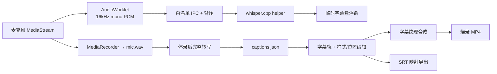

# Design: 本地实时字幕与字幕编辑

> **历史设计**：第一期实施架构已收敛为录制后离线任务，见
> [post-recording-captions/design.md](./changes/post-recording-captions/design.md)；本文件的实时 AudioWorklet 与悬浮窗不进入本期。

## 1. Architecture



- **Renderer / 录制**：复用同一麦克风流；MediaRecorder 保留原始录音，AudioWorklet 只生成低带宽转写 PCM。
- **Main / 转写**：`electron/transcription/index.ts` 做平台分发，`darwin.ts`、`win32.ts` 负责 helper 路径、生命周期和降级；录制主流程不等待转写。
- **Native helper**：基于 whisper.cpp，stdin 接收 16kHz 单声道 PCM，stdout 输出 JSON Lines；模型与 VAD 在进程内复用。
- **模型管理**：模型放在 `userData/models/whisper/`，首次启用时按需下载，校验大小与摘要后原子落盘；提供轻量和高精度两档。
- **悬浮窗**：Main 创建透明、置顶、不可被屏幕捕获的临时字幕窗；平台不支持排除捕获时不展示悬浮窗，但仍继续后台识别。
- **编辑与渲染**：字幕保存在源时间轴；Canvas2D 生成字幕位图，WebGL 合成器作为字幕纹理叠加，预览和导出共用实现。

## 2. Data Model & Interfaces

```typescript
interface CaptionPosition {
  x: number // 输出画布归一化坐标 0..1
  y: number
}

interface CaptionStyle {
  fontPreset: string
  fontSize: number
  textColor: [number, number, number, number]
  strokeColor: [number, number, number, number]
  strokeWidth: number
  backgroundColor: [number, number, number, number]
  cornerRadius: number
  align: 'left' | 'center' | 'right'
  maxWidthRatio: number
  position: CaptionPosition
  fadeMs: number
}

interface CaptionSegment {
  id: string
  startMs: number
  endMs: number
  text: string
  positionOverride?: CaptionPosition
}

interface CaptionsDocument {
  version: 1
  source: 'mic'
  language: 'auto' | 'zh' | 'en'
  detectedLanguage?: string
  style: CaptionStyle
  segments: CaptionSegment[]
}
```

- `captions.json` 与 `events.json` 同处会话目录，时间戳均相对录制起点。
- 字体使用随应用分发的 preset ID，禁止依赖用户机器上同名字体，保证导出一致。
- 第一版只保存句段时间，不要求逐词时间戳；样式全局生效，单条字幕只能覆盖位置。
- 关键 IPC：模型列表/下载/状态、实时转写 start/chunk/stop、最终转写/retry、临时字幕事件、SRT 导出。
- 所有跨进程通道和类型只定义在 `shared/`。

## 3. Data Flow & Interaction

1. 用户开启字幕并选择语言、模型档位；模型缺失时先下载并校验。
2. `ScreenRecorder` 在正式开始视频录制前获取麦克风，冻结录制起点与 `micOffsetMs`，避免首次授权造成整体偏移。
3. AudioWorklet 将麦克风混为单声道并重采样到 16kHz，以约 500ms chunk 送给 Main；队列满时丢弃临时识别 chunk，不阻塞录屏。
4. helper 使用 VAD 和重叠滑动窗口产生 partial/final 临时段；悬浮窗只显示临时结果，不写入原始画面或最终文档。
5. 停录后先完成 `mic.wav` 和会话落盘，再由 Main 后台执行完整转写并原子写入 `captions.json`；编辑器显示生成中、完成或可重试状态。
6. 编辑器加载字幕轨，允许修改文字、拖动起止时间、分割、合并、删除；画布拖动修改全局位置或当前段位置覆盖。
7. 预览按源时间查询活动字幕，CaptionBitmapRenderer 生成位图并交给 Compositor 叠加。
8. 导出 MP4 使用相同字幕渲染；SRT 将源区间投影到裁剪后输出时间轴，跨裁剪区的字幕按保留段分割。

## 4. Error Handling

- **无麦克风/权限拒绝**：字幕开关自动关闭并提示，屏幕录制仍可继续。
- **模型下载中断或校验失败**：清理临时文件，展示重试；不得留下可执行的不完整模型。
- **helper 启动/崩溃**：停止临时字幕并记录可读错误；录制不中断，停录后允许重试最终转写。
- **转写速度跟不上**：对实时队列实施上限和背压，优先保证录制；最终双遍转写补齐临时丢失内容。
- **悬浮窗无法排除捕获**：不展示悬浮窗，录制面板显示字幕状态，避免污染原始画面。
- **字幕文件损坏**：不进入字幕编辑，提示重新生成；视频、事件和音频仍正常加载。
- **字幕越界/空文本**：加载时钳制到真实视频时长，空段不参与预览、烧录和 SRT。
- **字体或绘制失败**：回退到内置默认中文字体和安全样式，不中断导出。
