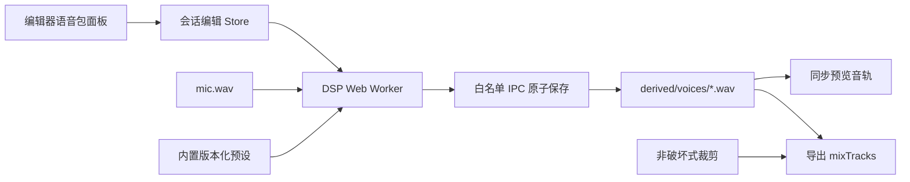

# Design: 本地语音包与非破坏式变声

## 1. Architecture



- DSP 在独立 Worker 中按块处理，逐块报告进度并响应取消；不得在 React 渲染线程或 Main 事件循环执行逐样本计算。
- 第一版使用同一套 TypeScript/Worker DSP 实现，不增加 darwin/win32 算法分支。
- Main 只负责安全读取原始麦克风、原子保存/读取/删除派生 WAV 和会话删除清理。
- 原声不是派生文件；选择原声时继续使用 `mic.wav`。
- 派生文件按“源音频指纹 + preset ID + preset version + engine version”缓存，相同输入不重复生成。
- 预览以派生轨替代麦克风轨并继续复用 `useSyncedAudio`；系统音频和自定义音轨保持原逻辑。

## 2. Data Model & Interfaces

```typescript
type VoicePackId = 'original' | 'deep' | 'bright' | 'broadcast' | 'robot'

interface VoicePackPreset {
  id: VoicePackId
  version: number
  name: string
  description: string
  previewColor: string
  processing: {
    pitchSemitones?: number
    formantRatio?: number
    highPassHz?: number
    lowPassHz?: number
    compression?: { thresholdDb: number; ratio: number }
    saturation?: number
    ringModHz?: number
    wet?: number
  }
}

interface VoiceEffectEdit {
  enabled: boolean
  presetId: VoicePackId
  presetVersion: number
  assetFile: string | null
  sourceFingerprint: string | null
}

type VoiceGenerationState =
  | { state: 'idle' }
  | { state: 'processing'; sessionId: string; presetId: VoicePackId; progress: number }
  | { state: 'done'; assetFile: string }
  | { state: 'cancelled' }
  | { state: 'error'; message: string }
```

- `EditDocument` 升级版本并保存 `voiceEffect`；旧版本迁移为关闭、原声且无派生文件。
- 文件固定放在 `derived/voices/<cache-key>.wav`，路径校验只允许会话目录内的该子目录和 `.wav`。
- 输出保持输入采样率、声道数、样本数与起点；无法满足时任务失败，不保存不完整资产。
- 预设 ID 和参数版本化；修改参数必须提升版本，使旧缓存自然失效。
- IPC 类型只定义在 `shared/`：读取麦克风、保存/读取/删除派生轨、任务所需的错误与结果契约。

## 3. DSP Pipeline

1. Worker 解析 WAV 并转换为浮点 PCM；不支持的格式返回用户可读错误。
2. 对所有预设先应用有限幅、直流偏移移除和安全余量。
3. `deep`/`bright` 使用保持总时长的 pitch shift，并独立调整 formant，禁止用简单 playbackRate 改变时长。
4. `broadcast` 使用高/低通、压缩、轻度饱和和响度补偿。
5. `robot` 使用 ring modulation、滤波和干湿混合，并保留原始静音区间。
6. 分块边界保留算法状态或使用重叠窗口与 crossfade，避免爆音和接缝。
7. 输出前执行峰值保护，编码为与输入等长的 PCM WAV。

## 4. Data Flow & Interaction

1. 用户打开含 `mic.wav` 的会话，在音频面板进入“语音包”。
2. 语音包卡片展示名称、简述和短试听；点击“应用”后开始生成完整派生轨。
3. 生成期间显示进度和取消；切换页面后任务可继续，但结果只写回对应 `sessionId`。
4. 成功后编辑文档选择该派生轨；普通/专注预览保持当前视频时间和播放状态切换音轨。
5. 用户切回原声时立即改用 `mic.wav`，不删除缓存；通过“清理派生音频”显式回收空间。
6. 导出时若语音包启用且缓存有效，以派生轨替代 mic 进入现有增益、静音、裁剪和混音流程。
7. preset 或 engine 版本变化时旧缓存保持可清理但不再自动使用，重新生成后更新 edit 引用。

## 5. Error Handling

- **无麦克风轨**：隐藏或禁用语音包入口，并说明系统音频和自定义音轨不参与变声。
- **解码/处理失败**：保持当前有效音轨，删除临时文件并提供重试。
- **内存或性能不足**：停止任务并建议使用原声；不得拖慢播放或录屏。
- **切换会话**：以 generation token 和 `sessionId` 双重校验结果，旧任务不得写入新会话 UI。
- **派生文件缺失/损坏**：安全回退原声并标记需要重新生成，不阻断会话加载和导出。
- **取消或退出应用**：终止 Worker，清理临时资产；已完成缓存不受影响。
- **导出时缓存失效**：明确提示重新生成或改用原声，不静默导出与预览不一致的音频。
