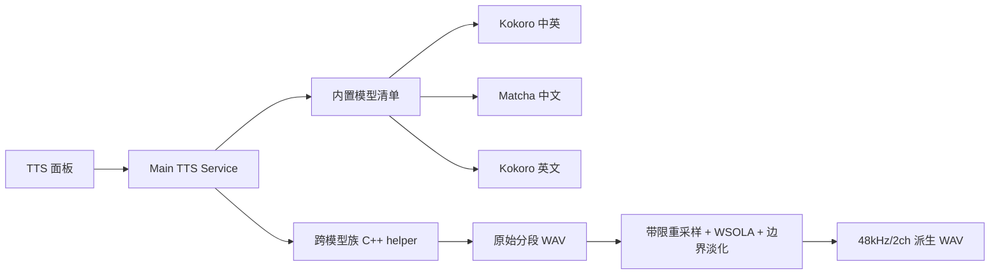

# Design: 高质量内置中英文 TTS 音色

## 1. Architecture

沿用 kr-08 的“Renderer 发任务 → Main 管理缓存 → 原生 helper 合成 → Main 组装 48k WAV”结构，不引入 Python 或云服务。模型清单扩展为显式模型族，helper 根据模型族填充 sherpa-onnx 的 Kokoro、Matcha 或 VITS 配置；官方 VITS 音色从产品清单移除，自定义 VITS 导入能力保持独立且不作为官方内置音色。



## 2. Data Model & Interfaces

`shared/ttsModels.json` 的模型记录增加 `family` 与模型族资源字段，Renderer 仍只消费稳定 `voiceId`，不接触本机路径。

```typescript
type TtsModelFamily = 'kokoro' | 'matcha' | 'vits'

interface BundledTtsModel {
  family: TtsModelFamily
  dir: string
  sampleRate: number
  files: Record<string, { size: number; sha1: string }>
}
```

- `kokoro-multi-lang-v1_1`：使用官方 int8 中英模型；从中文、英文 speaker 中人工筛选少量稳定 sid 暴露到 UI。
- `matcha-icefall-zh-baker`：中文单说话人声学模型 + `vocos-22khz-univ.onnx`。
- `kokoro-en-v0_19`：英文专用模型；从美式/英式男女声中人工筛选稳定 sid。
- 旧 `melo-zh`、`theresa-*`、`fanchen-c` voiceId 从清单移除，不提供迁移别名。
- TTS 缓存键继续包含 `voiceId + engineVersion`；引擎/清单版本提升后不复用旧段缓存。

helper 启动参数由 VITS 专用字段改为模型族中立协议，例如 `--family` 加各族资源参数；stdin JSON 的逐段任务协议保持不变，避免改动 service 与 IPC 业务载荷。

## 3. Data Flow & Interaction

1. 构建脚本下载并校验三套官方模型，把完整资源写入 `native/tts-helper/models/`。
2. electron-builder 与 release workflow 把三套模型和 helper 一并分发；缺任一强制资源时构建失败。
3. Main 解析模型清单，所有官方音色直接标记为 `available=true`，不再出现官方音色下载状态。
4. helper 按 `family` 创建对应 sherpa-onnx OfflineTts 配置并加载一次模型，逐段输出原始 WAV。
5. Main 组装时先进行带限重采样；仅超出字幕窗的段进入修正后的 WSOLA；写入派生轨前在有效语音边缘施加短淡入淡出。
6. 最终派生轨继续占用 mic 轨位，预览、裁剪和导出逻辑不变。

### 音频质量处理

- 用确定性的窗口化 sinc 或等价带限算法替换线性重采样，离线组装允许用更多计算换取质量。
- WSOLA 使用归一化互相关选择重叠位置，搜索范围必须钳制在有效输入内；短段降级不得产生越界补零或单样本跳变。
- 每段实际写入区间在首尾应用 5–10ms 淡入淡出；被下一段截断时同样在截断前淡出。
- 不对短于字幕窗的自然语音做减速，继续保留自然语速和静音余量。

## 4. Error Handling

- **内置资源缺失或摘要错误**：该音色不可生成并显示可读错误；`LENZA_REQUIRE_TTS_HELPER=1` 的打包构建直接失败。
- **Matcha Baker 许可限制**：随包 README 明确标注训练数据仅限非商业使用；当前只用于本地测试构建，正式商业发行前必须替换为权利清晰的中文专用模型或取得授权。
- **模型族不受当前 sherpa-onnx 支持**：PoC 阶段先验证已固定的 1.12.20；若 Kokoro v1.1 或 Matcha 资源无法加载，则统一升级固定版本并重新完成双平台 helper 构建，不保留混合运行时。
- **旧 voiceId**：不迁移、不重新生成；测试期旧会话引用按模型缺失处理。实现不得主动删除工作区外的用户录屏目录。
- **单段合成失败**：沿用现有失败段留静音并回传段 id 的语义，其他段继续生成。
- **质量基准失败**：任何固定语料出现电音、重复、漏读、爆音或明显机械变速时，该 sid 不得进入最终内置音色列表。
