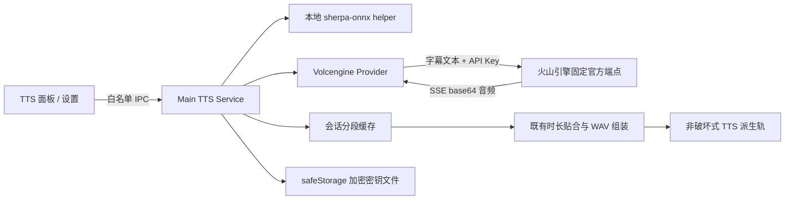

# Design: 火山引擎云端高清 TTS

## 1. Architecture

在 kr-08 既有“Renderer 编排字幕段 → Main 生成/缓存 → Main 组装派生 WAV”的路径中增加 provider 分发。`local` 继续调用原生 helper；`volcengine` 由 Main 直接访问火山引擎官方 V3 单向 SSE TTS 接口。Renderer 只接收密钥配置状态和末四位，不得回读已保存明文。



- 请求端点固定为火山引擎官方 `https://openspeech.bytedance.com/api/v3/tts/unidirectional/sse`，不允许用户自定义主机，避免密钥被发送到第三方地址。
- 鉴权使用新版单 Key 请求头 `X-Api-Key`；默认资源 ID 为 `seed-tts-2.0`，通过 `X-Api-Resource-Id` 发送并允许用户修改。
- API 适配以[火山引擎语音合成文档](https://www.volcengine.com/docs/6561/1257536?lang=zh)和[ByteDance 官方示例](https://github.com/bytedance/agentkit-samples/blob/main/skills/byted-text-to-speech/scripts/text_to_speech.py)为准。

## 2. Data Model & Interfaces

跨进程契约增加 provider、公共配置状态和仅写凭据命令。API Key 只允许作为一次性 IPC 入参进入 Main；Main 保存完成后 Renderer 清空输入框，任何读取接口都只返回脱敏状态。

```typescript
type TtsProvider = 'local' | 'volcengine'

interface VolcengineTtsPublicConfig {
  configured: boolean
  keySuffix?: string
  resourceId: string
  consentVersion?: number
  credentialRevision: number
}

interface SaveVolcengineCredentialRequest {
  apiKey: string
  resourceId: string
}

interface VolcengineVoiceConfig {
  voiceId: string
  source: 'curated' | 'custom'
}
```

- Main 新增独立凭据存储模块，使用 Electron `safeStorage.encryptString()` 加密，并把密文写入 `app.getPath('userData')` 下的专用 secret 文件。macOS 由 Keychain、Windows 由 DPAPI 等系统能力保护；若 `safeStorage.isEncryptionAvailable()` 为 false，拒绝保存且绝不降级为明文。
- `settings.json` 只允许保存非秘密配置，例如资源 ID、同意版本、最近选择的 provider/voice；不得保存 API Key、完整密文或可逆替代值。
- 每次新增、替换或清除 Key 都递增非秘密的 `credentialRevision`。云端原始段缓存键包含 `provider + text + voiceId + resourceId + credentialRevision + providerVersion`，不包含 API Key 本身；字幕时间变化只重跑既有贴合与组装。
- voice ID 使用 provider 命名空间，避免与本地 voice ID 冲突。精选中英文音色随应用清单提供；用户可添加控制台中的自定义 voice ID。
- 设置页提供“仅保存到本地”“测试连接”“替换”“清除”。测试连接合成固定短句，并与实际生成共用同一 provider 解析和错误映射。

## 3. Data Flow & Interaction

1. 应用启动时，Main 加载脱敏配置状态；本地 provider 始终是默认值，云端仅在已配置 Key 时标记为可生成。
2. 用户在设置中输入 Key 和资源 ID，Renderer 通过专用白名单 IPC 一次性提交；Main 校验非空和格式、用 `safeStorage` 加密落盘，再只返回 `configured + keySuffix`。
3. 用户点击“测试连接”时，界面在第一次传输前说明将向火山引擎发送固定测试文本并可能产生少量费用；确认后 Main 发起一次真实合成并播放或报告结果。
4. 用户选择火山引擎精选音色或自定义 voice ID。第一次实际生成前，界面披露“仅发送字幕文本，不发送视频、麦克风音频或其他文件”，并展示字幕段数、Unicode 字符数与可能产生费用的提示。
5. 用户确认后，Main 按字幕段顺序检查原始段缓存。缓存未命中的段逐条调用 V3 SSE 接口，校验响应 code，解码 base64 音频并转换为既有组装管线需要的 WAV/PCM。
6. 成功段立即以原子文件写入本地缓存；任务全部成功后才组装并原子替换最终派生轨。后续生成始终显示段数与字符数，但不重复弹出同版本隐私确认。
7. 用户修改字幕时间但不改文字时复用原始段；修改文字、voice ID、资源 ID 或凭据修订时只重新请求受影响段。

云端同意按版本记录在本机，隐私披露内容变化时提升版本并重新征得同意。测试连接与实际生成均必须在首次外发文本前完成披露；单纯保存 Key 不发送网络请求。

## 4. Error Handling

- **未配置或密钥被清除**：云端音色显示“需先配置”，生成按钮不可用；本地模型不受影响。
- **系统加密不可用**：拒绝保存并提示当前系统无法安全保管密钥，不提供明文回退。
- **Key、资源或音色无权限**：把火山响应映射为可读错误，指出应检查 API Key、资源 ID、套餐与 voice ID；不得在错误或日志中输出请求头、完整响应凭据或字幕全文。
- **网络超时、限流或服务端错误**：当前任务失败，不自动切换本地音色，也不自动重试整个任务；保留此前最终派生轨与本次已经成功的分段缓存。用户重试时只请求仍未命中的段。
- **SSE 响应异常或音频损坏**：丢弃该临时段，保持最终派生轨不变，并显示对应字幕段的可读失败原因。
- **取消或切换会话**：中止未完成请求；完成回调按 `sessionId/taskId` 隔离，不能写入其他会话。
- **精选音色不属于用户套餐**：不把它视为应用故障；提示用户改选其他精选音色或填写控制台中的自定义 voice ID。
- **清除 Key**：删除本地 secret 文件中的凭据记录并递增修订；已有派生轨和缓存保留为本地文件，但后续云端生成必须重新配置。

